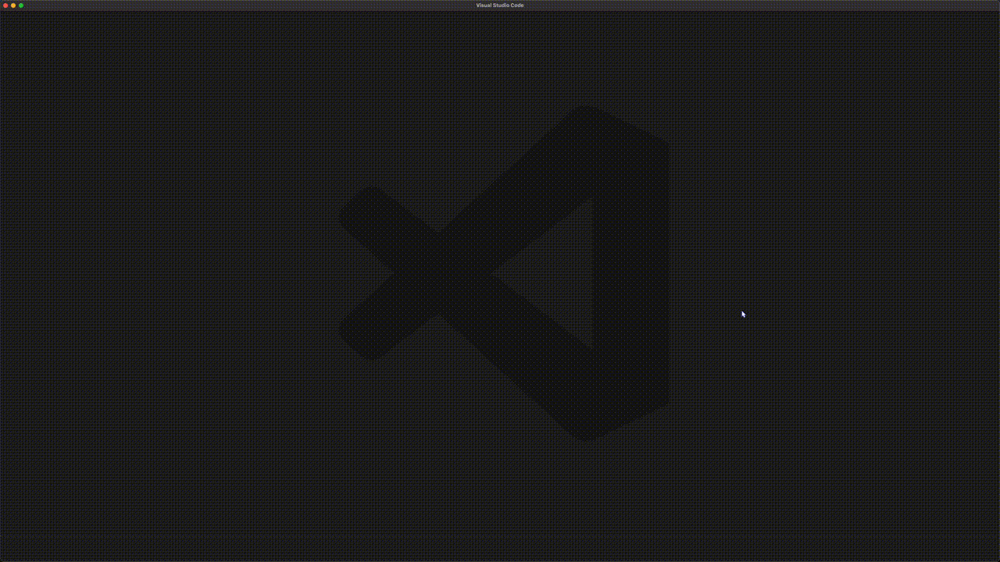

# VS Code Sessionizer

## Demo

## Link

https://marketplace.visualstudio.com/items?itemName=omercohen.vscode-sessionizer

## Overview

Easily open directories in specified roots by fuzzy finding them.

Based on the notion that fuzzy finding is the fastest and most efficient way to selecting items.

## How To Use

first, specify the `sessionizer.sessionRoots` setting, which is an array of the root directories of project directories, for example: ["\~/Desktop/projects", "\~/Desktop/work"]

Then, open the command palette (cmd+shift+p) and run any one of the following commands:

- `Sessionizer: Open` (Will open the directory using the `code` command)
- `Sessionizer: Open In Place` (Will open the directory using the `code` command with the `-r` flag)

You will be prompted to select a directory from any one of the roots specified.

It is recommended to [create a keybinding](https://code.visualstudio.com/docs/getstarted/keybindings) (for example, cmd+shift+s) to the command.

## Notes

The `code` cli command needs to be installed on the system. Run the `Shell Command: Install 'code' command in PATH` VS Code command if you haven't yet.

Will not work on Windows, as it's dependent on the `find` Unix command.

## Credits

A port of [ThePrimeagen's tmux-sessionizer](https://github.com/ThePrimeagen/.dotfiles/blob/master/bin/.local/scripts/tmux-sessionizer) to VS Code.
